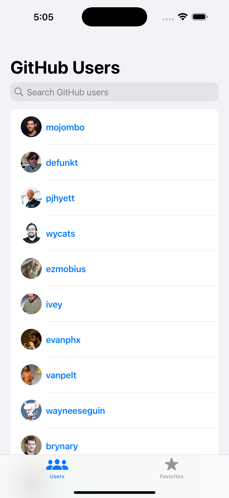
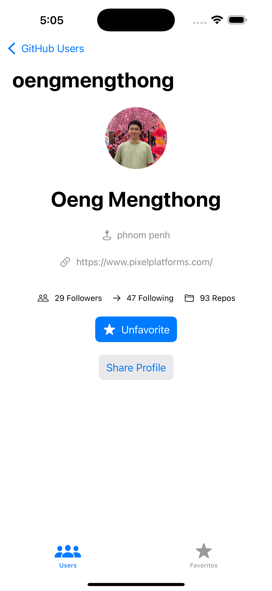
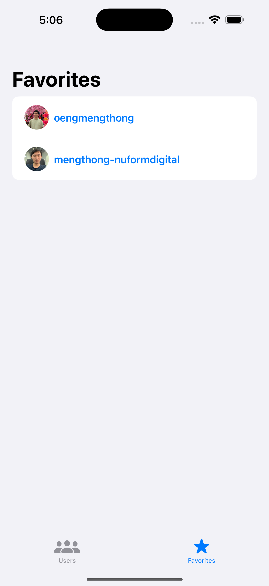

# GitHubUsersApp

A SwiftUI iOS app that lists GitHub users using the GitHub REST API. Includes infinite scroll, real-time search from the API, favorites using SwiftData, and detailed user profiles.

---

## 🚀 Features

- 🔍 **Search GitHub Users** via GitHub's Search API (`/search/users?q=...`)
- 🔄 **Infinite Scroll** using pagination with `since` parameter
- ⭐ **Favorite Users** persisted using SwiftData
- 🔗 **Share Profile** via native `UIActivityViewController`
- 🧭 **MVVM Architecture** with a simple Coordinator pattern
- 🧪 Built with **SwiftUI**, **Combine**, and **SwiftData**

---

## 🖼 Screenshots

| User List | Detail Page | Favorites Tab |
|-----------|-------------|----------------|
|  |  |  |

---

## 🛠 Technologies

- **SwiftUI** – Declarative UI framework
- **Combine** – For reactive data flow
- **SwiftData** – Local persistence for favorite users
- **GitHub REST API** – `/users`, `/search/users`, `/users/{username}`

---

## 📦 Project Structure

```text
.
├── Models
│   ├── GitHubUser.swift
├── Networking
│   └── DTOs
│       ├── GitHubUserDTO.swift
│       ├── GitHubSearchResponse.swift
│       └── GitHubUserDetailDTO.swift
├── ViewModels
│   ├── UserListViewModel.swift
│   └── UserDetailViewModel.swift
├── Views
│   ├── MainTabView.swift
│   ├── UserListScreen.swift
│   ├── FavoritesScreen.swift
│   └── UserDetailScreen.swift
├── Coordinators
│   └── AppCoordinator.swift
└── GitHubUsersApp.swift (entry point)
